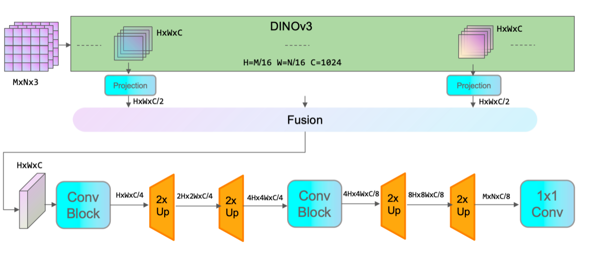
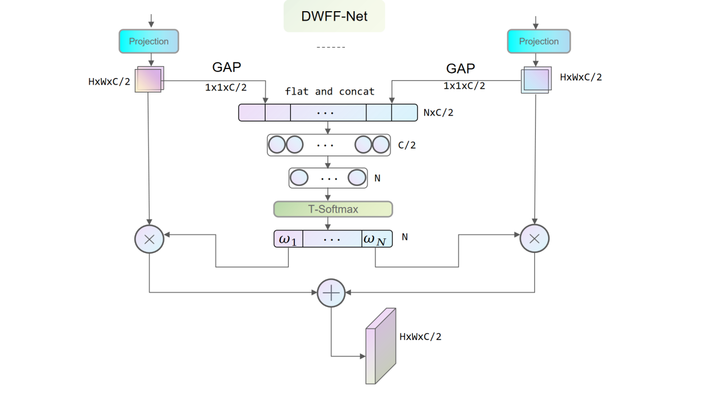
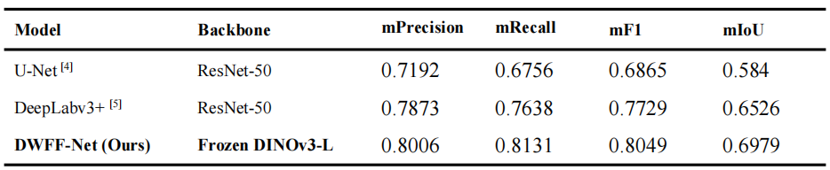

# A Method for Identifying Farmland System Habitat Types Based on the Dynamic-Weighted Feature Fusion Network Model

[](LICENSE)
[](https://www.python.org/downloads/)
[](https://pytorch.org/)
[](https://github.com/facebookresearch/dinov3)

This repository contains the official implementation of our paper "A Method for Identifying Farmland System Habitat Types Based on the Dynamic-Weighted Feature Fusion Network Model" published in [TODO].

## Table of Contents

- [Introduction](#introduction)
- [Architecture](#architecture)
- [Installation](#installation)
- [Dataset Preparation](#dataset-preparation)
- [Training](#training)
- [Evaluation](#evaluation)
- [Results](#results)
- [Comparison Experiments](#comparison-experiments)
- [Citation](#citation)
- [Acknowledgements](#acknowledgements)

## Introduction

In this paper, we propose DWFF-Net (Dynamic-Weighted Feature Fusion Net), a novel approach for remote sensing image semantic segmentation. Our method leverages the powerful pre-trained DINOv3 vision transformer as the backbone and introduces a Dynamic-Weighted feature fusion module to effectively capture both high level semantic information and low level details.

The study addresses the current lack of a standardized habitat classification system for cultivated land ecosystems, incomplete coverage of habitat types, and the inability of existing models to effectively integrate semantic and texture features resulting in insufficient segmentation accuracy and blurred boundaries for multi-scale habitats. 

Key contributions:
1. A comprehensively annotated ultra-high-resolution remote sensing image dataset encompassing 15 categories of cultivated land system habitats
2. Dynamic-Weighted Feature Fusion Network (DWFF-Net) that utilizes a frozen-parameter DINOv3 to extract foundational features with a data-level adaptive dynamic weighting strategy for feature fusion
3. Superior performance compared to state-of-the-art methods with mIoU of 0.6979 and F1-score of 0.8049


## Architecture

Our proposed DWFF-Net consists of three main components:

1. **Backbone**: DINOv3 vision transformer (pre-trained) - A frozen DINOv3-ViT-L/16 model is used as a multi-level feature extractor
2. **Feature Extractor**: Multi-level feature extraction from different transformer layers (specifically layers 1, 8, 16, and 24 as shown in the configuration)
3. **Decoder**: Dynamic-weighted feature fusion network for semantic segmentation - A novel decoder that features a Dynamic Weight Feature Fusion (DWFF) mechanism to produce the final segmentation map

 

Dynamic-Weighted Feature Fusion Net

## Installation

1. Clone this repository:
```bash
git clone https://github.com/sysau/DWFF-Net.git
cd DWFF-Net
```

2. Install required packages:
```bash
pip install -r requirements.txt
```

Note: This project requires Python 3.8+, PyTorch 2.0+, and the DINOv3 model from Hugging Face Transformers. Training was conducted with a batch size of 4 (with gradient accumulation every 8 rounds, resulting in an effective batch size of 32) distributed over double RTX 2080Ti 11G GPUs, using mixed-precision training (FP16 mixed-precision).

3. Download DINOv3 model weights:
Due to licensing constraints, please download the DINOv3 model weights from the [official repository](https://github.com/facebookresearch/dinov3).

## Dataset Preparation

The dataset should be organized in the following structure:

```
data/
├── JPEGImages/
│   ├── sample1.jpg
│   ├── sample2.jpg
│   └── ...
├── SegmentationClass/
│   ├── sample1.png
│   ├── sample2.png
│   └── ...
├── train.txt
├── val.txt
└── test.txt
```

The dataset contains 16 classes for habitat segmentation:
1. _background_
2. arbor-shrub-grass compound land
3. dry land
4. grass belt
5. scattered trees
6. dirt road
7. paved road
8. forest belt
9. woody area
10. unused land
11. paddy field
12. ridge
13. construction land
14. river
15. tidal flats
16. water

This dataset was constructed specifically for cultivated land system habitats with ultra-high-resolution remote sensing imagery acquired by the FeimaRobotics V500 UAV system with a spatial resolution of 0.1 m. The study area is located in the Hailun River Basin of Hailun City, Heilongjiang Province, China. The dataset contains 800 total records divided into train, val, and test sets in a 6:1:1 ratio.

## Training

### DWFF-Net (Dynamic-Weighted Feature Fusion Net)
```bash
cd DWFF-Net
./train.sh
```

Configuration file: [config.yaml](DWFF-Net/config.yaml)
- Uses dynamic weighted feature fusion with layers [1, 8, 16, -1] (corresponding to layers 1, 8, 16, and 24)

### NWFF-Net (Non-Weighted Feature Fusion Net)
```bash
cd NWFF-Net
# For different configurations:
./train_1.sh  # Single level feature (layer -1)
./train_2.sh  # Two-level feature fusion (layers 1, -1)
./train_3.sh  # Three-level feature fusion (layers 1, 16, -1)
./train_4.sh  # Four-level feature fusion (layers 1, 8, 16, -1)
```

Configuration files:
- [config-1.yaml](NWFF-Net/config-1.yaml) - Single layer feature (layer -1)
- [config-2.yaml](NWFF-Net/config-2.yaml) - Two-level feature fusion (layers 1, -1)
- [config-3.yaml](NWFF-Net/config-3.yaml) - Three-level feature fusion (layers 1, 16, -1)
- [config-4.yaml](NWFF-Net/config-4.yaml) - Four-level feature fusion (layers 1, 8, 16, -1)

### SWFF-Net (Static-Weighted Feature Fusion Net)
```bash
cd SWFF-Net
./train.sh
```

Configuration file: [config.yaml](SWFF-Net/config.yaml)
- Uses static weighted feature fusion with layers [1, 8, 16, -1] (corresponding to layers 1, 8, 16, and 24)

## Evaluation

To evaluate a trained model:

```bash
python main.py --config config.yaml --mode test --checkpoint path/to/checkpoint.ckpt
```

Test results will be saved in the `test_predictions` directory as int8 type npy files. The evaluation metrics include Precision, Recall, F1-score, and Intersection over Union (IoU) for each of the 16 classes.

## Results

Our method achieves state-of-the-art performance on the habitat segmentation dataset with an mIoU of 0.6979 and F1-score of 0.8049, outperforming the baseline network.



The model was trained for 150 epochs using the AdamW optimizer with a cosine-annealed learning rate.

More detailed results can be found in our paper.

## Comparison Experiments

We also compare our method with popular segmentation architectures:

### U-Net with ResNet50 Encoder
```bash
cd compare-exp
./train_unet.sh
```

Configuration: [config_unet.yaml](compare-exp/config_unet.yaml)

### DeepLabV3+ with ResNet50 Encoder
```bash
cd compare-exp
./train_deeplab.sh
```

Configuration: [config_deeplabv3p.yaml](compare-exp/config_deeplabv3p.yaml)

## Citation

If you find this work useful in your research, please cite our paper:

```bibtex
@article{zheng2025dwffnet,
  title={A Method for Identifying Farmland System Habitat Types Based on the Dynamic-Weighted Feature Fusion Network Model},
  author={Zheng, Kesong and Song, Zhi and Li, Peizhou and Yao, Shuyi and Bian, Zhenxing},
  journal={TODO},
  year={2025}
}
```

## Acknowledgements

This work was supported by [Scientific Research Fund of Liaoning Provincial Education Department of China under [Grant number LJ212510157036].]. We thank the authors of DINOv3 for releasing their pre-trained models. We also thank the contributors of the open-source libraries used in this project.
